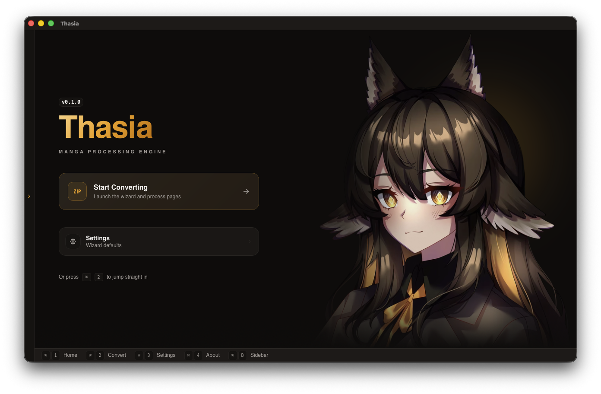
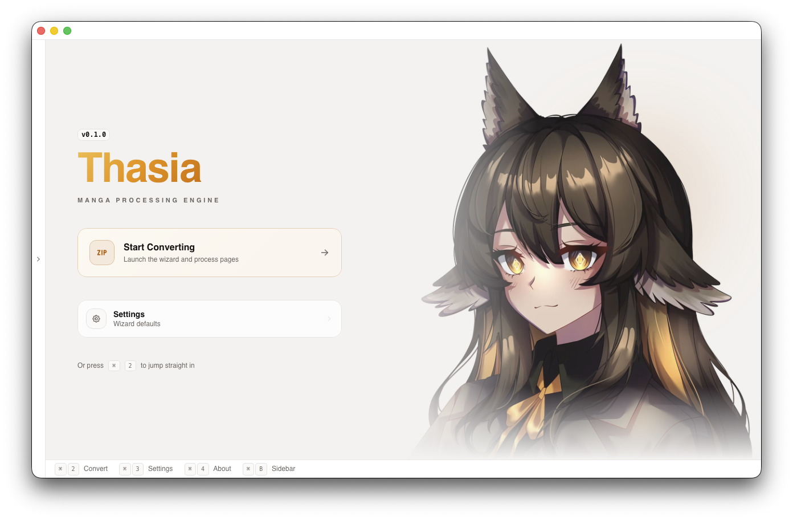
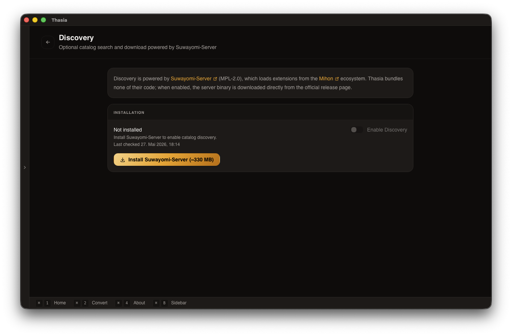
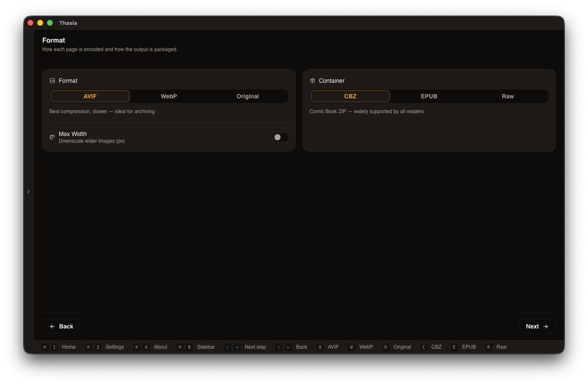
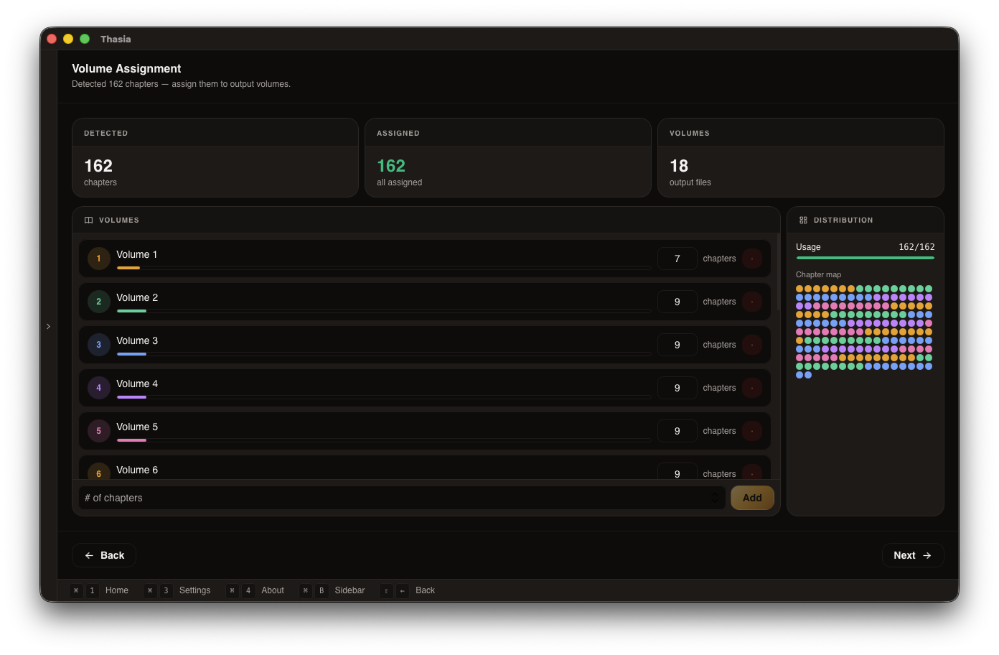
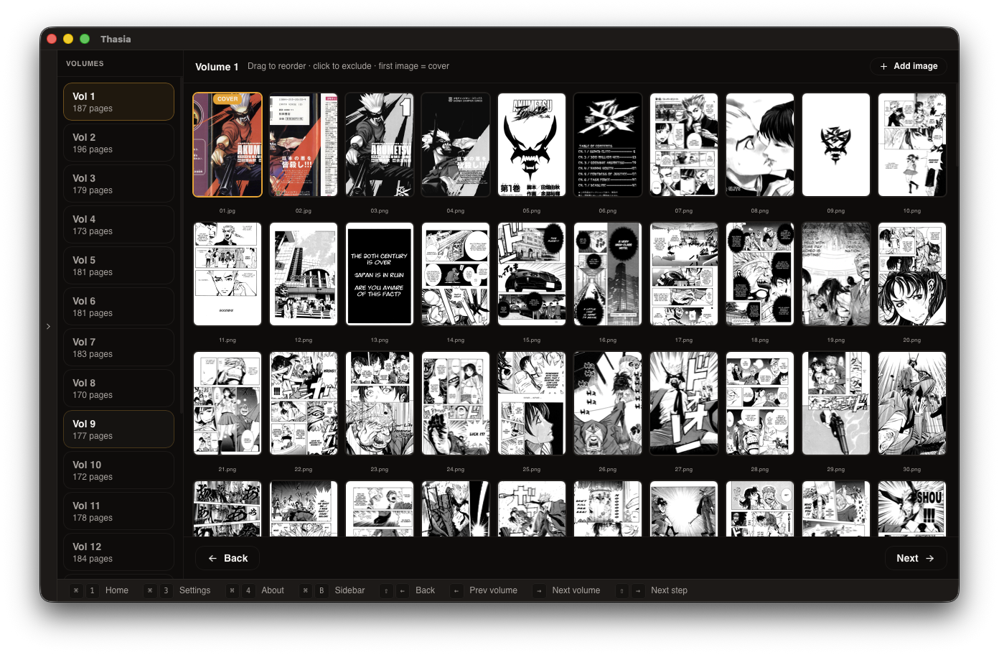

<div align="center">


# Thasia

**A blazingly fast, next-generation manga processing engine for Windows, Linux, and macOS**

Convert, optimize, and package your manga into CBZ or EPUB formats. Featuring intelligent auto-detection, a visual page editor, advanced AVIF/WebP encoding, and a fully parallelized pipeline.

[](LICENSE)
[](https://github.com/LuMiSxh/Thasia/releases)

[Features](#features) • [Installation](#installation) • [Quick Start](#quick-start) • [Development](#development)

<br />



</div>

---

From _Anastasia_ — meaning "resurrection" or "rise again". Thasia is a complete, ground-up rebuild of its predecessor, [Palaxy](https://github.com/LuMiSxh/Palaxy). It is faster, cleaner, designed to grow, and solves manga processing properly with a brand new engine written in Rust and a beautiful Tauri v2 + Svelte 5 interface.

---

## Features

### Intelligent Parsing Engine

Thasia completely overhauls how manga is detected, using a custom lexical analyzer (`logos`) to scan your directories and files:

- **Direct Archive Support:** Directly import `.zip` and `.cbz` files without manual extraction.
- **Pattern Recognition:** Automatically detects volume, chapter, and page structures. Supports HakuNeko-style names (`001-023/01.png`), explicit names (`Vol 1/Ch 24`), and intelligent folder-depth fallbacks.
- **Smart Bundling:** Group output by detected volume or flatten everything into a single massive file.

### Advanced Image Encoding

Fully parallelized across all your CPU cores using Rayon for maximum performance:

- **Original:** Zero re-encoding for the absolute fastest processing speed.
- **AVIF (AV1 Image Format):** Best-in-class compression. Features a custom 5-tier adaptive quality tuner and an incredibly fast grayscale detector that bypasses chroma plane encoding for black-and-white manga, resulting in tiny file sizes.
- **WebP:** Excellent balance between compression speed and broad device compatibility.
- **Downscaling:** Automatically resize wide/large images to a maximum width (e.g., 1920px) to save space.

### Visual Page Editor

Take full control over your output before you convert:

- **Drag & Drop:** Reorder pages intuitively.
- **Custom Covers:** Inject custom cover images from your computer and assign them as the EPUB/CBZ cover.
- **Exclusions:** Exclude unwanted credits, scanlator pages, or ads with a single click.
- **Volume Assignment:** Visually assign how many chapters or pages belong to each output volume.

### Multiple Output Formats

- **CBZ (Comic Book Archive):** Optimized ZIP compression (uses `Stored` mode for already compressed AVIF/WebP to save CPU time). Perfect for Kavita, Komga, and comic readers.
- **EPUB 3.0:** E-reader optimized fixed-layout EPUBs with native support for both **Left-to-Right (LTR)** and **Right-to-Left (RTL)** reading directions.
- **Raw Directory:** Dumps sequentially numbered pages into flat folders.

### Power-User Interface

- **Keyboard-First Design:** Full keyboard shortcut support (`Shift+Arrow` navigation, quick-toggles) with a smart visual key-hint bar at the bottom of the screen.
- **Bespoke Themes:** Toggle between beautifully crafted Light mode (_Luxury Cathedral_) and Dark mode (_Immortal Abyssal_) featuring subtle metallic gold accents.

<p align="center">
  
  
</p>

## Direct Manga Downloads

Thasia integrates directly with [Suwayomi](https://github.com/Suwayomi/Suwayomi-Server), enabling you to discover, search, and download manga from hundreds of sources without ever leaving the application.

- **Internal Management:** Thasia can automatically download and set up the Suwayomi-Server for you.
- **Native Experience:** Search for manga, browse your library, and download chapters directly into Thasia's processing pipeline.
- **All-in-One Tool:** No need for external downloaders or manual file moving—Thasia handles everything from discovery to the final EPUB/CBZ.

<p align="center">
  
</p>

---

## Installation

Visit the [releases page](https://github.com/LuMiSxh/Thasia/releases) and download the latest version for your operating system:

- **Windows**: `Thasia_x.x.x_x64_en-US.msi` or `Thasia_x.x.x_x64-setup.exe`
- **macOS Intel**: `Thasia_x.x.x_x64.dmg`
- **macOS Apple Silicon**: `Thasia_x.x.x_aarch64.dmg`
- **Linux**: `Thasia_x.x.x_amd64.AppImage`, `.deb`, or `.rpm`

### System Requirements

- **OS**: Windows 10+, macOS 11+, or modern Linux distribution
- **RAM**: 2GB minimum, 4GB+ recommended for highly parallelized AVIF encoding
- **Disk**: Temporary space equal to the size of your input manga (if using archives)

---

## Quick Start

### Graphical Interface Workflow

Thasia uses a streamlined wizard to guide you through the conversion:

**Step 1: Source & Destination**
Drag and drop your manga folder, `.zip`, or `.cbz` file into Thasia. Pick where you want the converted files to be saved.

**Step 2: Format & Bundling**
Choose your encoding (AVIF, WebP, or Original) and your container (CBZ, EPUB, or Raw). If you choose EPUB, select your preferred reading direction (RTL/LTR).

<br />


**Step 3: Bundling & Volumes**
Visually adjust how many chapters go into each volume if the auto-detection needs tweaking.

<br />


**Step 4: Page Editor**
Review your pages. Drag to reorder, click to exclude scanlator notes, or click "Add Image" to insert a custom cover.

<br />


**Step 5: Convert**
Review your conversion and hit "Start Converting". Watch the real-time progress bars as Thasia maximizes your CPU threads to encode and package your volumes.

## Development

Thasia is built using a modern stack: **Rust (Edition 2024)**, **Tauri v2**, **Svelte 5**, and **Tailwind CSS v4**.

### Prerequisites

- [Node.js](https://nodejs.org/) 22+
- [pnpm](https://pnpm.io/) (required)
- [Rust](https://www.rust-lang.org/) 1.70+
- Rust component: `rustup component add llvm-tools-preview`
- [CMake](https://cmake.org/) (required for bundled AVIF decoding used by forced AVIF re-encode)
- [Tauri v2 Prerequisites](https://v2.tauri.app/start/prerequisites/) for your OS

Linux developers should also install `lld` for the workspace linker configuration:

```bash
sudo apt-get install lld
```

### Setup

```bash
# Clone the repository
git clone https://github.com/LuMiSxh/Thasia.git
cd Thasia

# Install frontend dependencies
pnpm install

# Run the Tauri app in development mode
pnpm run tauri dev

# Build for production
pnpm run tauri build
```

### Architecture

Thasia is split into a multi-crate Rust workspace to keep concerns cleanly separated:

- `thasia-core`: Error handling and shared data models.
- `thasia-parser`: Lexical analysis of file paths (extracts volume/chapter numbers).
- `thasia-source`: File discovery and ZIP/CBZ extraction.
- `thasia-processor`: Parallel image encoding (AVIF/WebP) and grayscale detection.
- `thasia-packager`: CBZ and EPUB generation.
- `src-tauri`: The Tauri backend and Specta type-bindings.
- `src`: The Svelte 5 frontend.

---

## License

This project is licensed under the BSD-3 Clause License - see the [LICENSE](LICENSE) file for details.

---

## Acknowledgments

- Built with [Tauri v2](https://v2.tauri.app) and [Svelte 5](https://svelte.dev)
- Fast AVIF encoding powered by [ravif](https://github.com/kornelski/ravif-rs) and [rav1e](https://github.com/xiph/rav1e)
- The successor to [Palaxy](https://github.com/LuMiSxh/Palaxy)

---

<div align="center">

**Made with passion by LuMiSxh**

[GitHub](https://github.com/LuMiSxh/Thasia) • [Issues](https://github.com/LuMiSxh/Thasia/issues) • [Releases](https://github.com/LuMiSxh/Thasia/releases)

</div>
